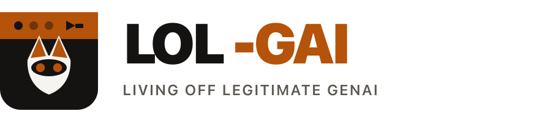
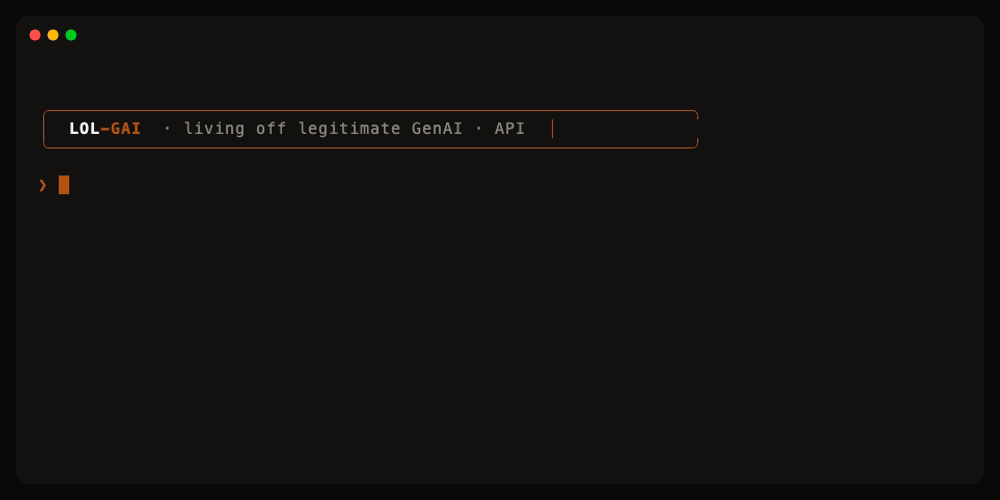

<p align="center">
  <a href="https://lolgai.io">
    
  </a>
</p>

<h1 align="center">LOL-GAI</h1>

<p align="center">
  <b>Living Off Legitimate GenAI</b><br/>
  A <em>living-off-the-land</em> catalog (deliberate play on LOLBins) for GenAI tools on<br/>
  developer workstations and endpoints.
</p>

<p align="center">
  <a href="https://lolgai.io"></a>
  <a href="LICENSE"></a>
  <a href="yaml"></a>
  <a href="CONTRIBUTING.md"></a>
</p>

<p align="center">
  
  
  
  
  
</p>

<p align="center">
  <a href="https://lolgai.io/#catalog">Catalog</a> ·
  <a href="https://lolgai.io/#/api">API</a> ·
  <a href="https://lolgai.io/#/lab">Lab install</a> ·
  <a href="CONTRIBUTING.md">Contribute</a> ·
  <a href="YML-Template.yml">YAML template</a>
</p>

<br/>

<p align="center">
  <a href="https://lolgai.io/#/api">
    
  </a>
</p>

<p align="center"><sub>Static JSON/CSV API: curl it, jq it, wire it into detections.</sub></p>

<br/>

<table align="center">
  <tr>
    <td align="center" width="25%">
      <a href="https://lolgai.io/#catalog"></a><br/>
      <b><a href="https://lolgai.io/#catalog">Catalog</a></b><br/>
      <sub>123 tools · grades · MITRE</sub>
    </td>
    <td align="center" width="25%">
      <b><a href="https://lolgai.io/#/api">API</a></b><br/>
      <sub>JSON · CSV · per-tool</sub>
    </td>
    <td align="center" width="25%">
      <b><a href="https://lolgai.io/#/lab">Lab</a></b><br/>
      <sub>Install script · gist</sub>
    </td>
    <td align="center" width="25%">
      <b><a href="CONTRIBUTING.md">Contribute</a></b><br/>
      <sub>One YAML per tool</sub>
    </td>
  </tr>
</table>

---

## Try the API

```bash
curl -sS https://lolgai.io/public/api/stats.json | jq .
curl -sS https://lolgai.io/public/api/binaries.csv | rg -i '^claude,'
curl -sS https://lolgai.io/public/api/tools/claude.json \
  | jq '{id,name,bin,vendor,grade,verificationLevel,mitre}'
```

| Endpoint | What you get |
|----------|----------------|
| [`tools.json`](https://lolgai.io/public/api/tools.json) | Full catalog (site UI shape) |
| [`tools/<id>.json`](https://lolgai.io/public/api/tools/claude.json) | One tool per file |
| [`lookup.json`](https://lolgai.io/public/api/lookup.json) | id / name / binary / alias → tool id |
| [`binaries.csv`](https://lolgai.io/public/api/binaries.csv) | Process names → tool IDs |
| [`domains.csv`](https://lolgai.io/public/api/domains.csv) | Network destinations → tool IDs |
| [`stats.json`](https://lolgai.io/public/api/stats.json) | Summary counters |

Local preview: `make serve` then `http://127.0.0.1:8765/public/api/...`

## Lab installer

Spin up GenAI CLIs / desktops / MCP servers on a lab host to exercise attribution.
[Gist](https://gist.github.com/Mikaayenson/3f05db683761ba604bec1575607dce0c) · v1.9.2 · pin `ce115bc9e0ca59619269a7f670ce2a1a3e9c6bcc`

```bash
curl -fsSL -o install-genai-tools.sh \
  "https://gist.githubusercontent.com/Mikaayenson/3f05db683761ba604bec1575607dce0c/raw/ce115bc9e0ca59619269a7f670ce2a1a3e9c6bcc/install-genai-tools.sh"
bash install-genai-tools.sh --list
bash install-genai-tools.sh --tool claude --yes
```

Tool IDs match `yaml/**/*.yaml` `Id` fields.

## Build

```bash
python3 -m venv .venv && source .venv/bin/activate
pip install -r requirements.txt
make build    # validate + generate website/public/api/
make serve    # http://127.0.0.1:8765/
```

## Scope

| | |
|---|---|
| **In** | Processes/binaries, helpers, install/config paths, domains, signing, abuse recipes, attribution |
| **Out** | IDE-only chat, cloud SaaS with no host footprint, bare `python`/`node`, sample SIEM rules |

Grades (A/B/C) = **catalog completeness**, not severity.
`VerificationLevel` = how the entry was checked (Unverified / Documented / Observed).

## Contributing

PRs welcome. One YAML file per tool.
See [CONTRIBUTING.md](CONTRIBUTING.md) and [lolgai.io/#contribute](https://lolgai.io/#contribute).

<p align="center">
  <a href="https://lolgai.io"></a><br/>
  <sub><a href="https://lolgai.io">lolgai.io</a> · Apache-2.0</sub>
</p>
